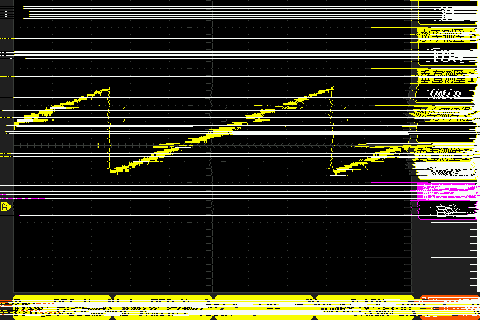

# Air001单片机USART1外接RC电路模拟DAC生成锯齿波

## 介绍

该程序演示了如何使用Air001单片机的USART1 TX引脚外接RC电路来模拟DAC（数模转换器）并生成锯齿波信号。通过USART1 TX引脚和外部RC电路的组合，我们可以在外部电路上模拟一个简单的DAC，生成类似模拟信号的锯齿波。

## 原理和应用

### 原理解析

@TSINGHUAJOKING卓晴

https://www.bilibili.com/video/BV1N642137Fp/

https://www.bilibili.com/video/BV1LB42167BT/

### 高级应用

@Xxfxfxfxfdx

https://www.bilibili.com/video/BV18T4m1S7E9

## 硬件连接

确保Air001单片机的USART1 TX引脚与外部RC电路正确连接。建议的连接方式如下：

- TX引脚连接到一个10K电阻，10K电阻的另一端连接着输出。
- 输出端有一个0.1uF的贴片电容连接到GND。

## 编译和烧录

使用适当的工具链和IDE来编译该程序。确保正确配置USART1和相关的引脚。编译成功后，将生成的二进制文件烧录到Air001单片机。

## 使用

启动程序后，Air001单片机将通过USART1的TX引脚(PA0)发送信号。你可以通过连接外部RC电路的输出到示波器或其他设备，来观察生成的锯齿波形。
